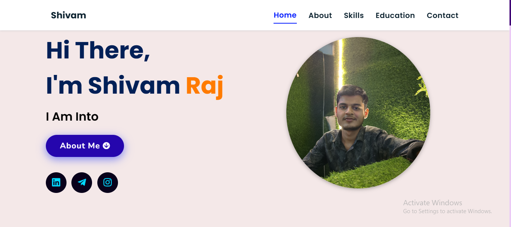

# Portfolio Website

This is my personal portfolio website created using **HTML, CSS, and JavaScript**.  
The website showcases my skills, projects, and contact information in a clean and responsive layout.

## Features
- **Responsive Design** – Works on all devices (desktop, tablet, mobile).
- **Projects Section** – Highlights my key projects with descriptions.
- **Contact Form** – Allows visitors to get in touch.
- **Clean UI** – Minimal and modern design.

## Technologies Used
- **HTML5** – Structure of the website.
- **CSS3** – Styling and layout.
- **JavaScript** – Interactive elements.
- **GitHub Pages** – Hosting the website.

## Live Demo
[Click here to view the website](https://shivam1455.github.io/portfolio/)

## How to Use
1. Clone the repository:
   ```bash
   git clone https://github.com/your-username/portfolio.git


   # Shivam Raj – Portfolio Website

This is my personal portfolio website showcasing my skills, projects, and education details.  
The site is built using **HTML, CSS, and JavaScript**, with a modern and responsive design.

---

## 📸 Screenshot


---

## 🚀 Features
- **Responsive Design** – Works on desktop, tablet, and mobile devices.
- **Smooth Navigation** – Includes Home, About, Skills, Education, and Contact sections.
- **Social Links** – LinkedIn, Instagram, Telegram icons for easy connectivity.
- **About Me Button** – Directs visitors to the "About" section.

---

## 📂 Usage
1. **Clone this repository:**
   ```bash
   git clone https://github.com/your-username/portfolio.git

